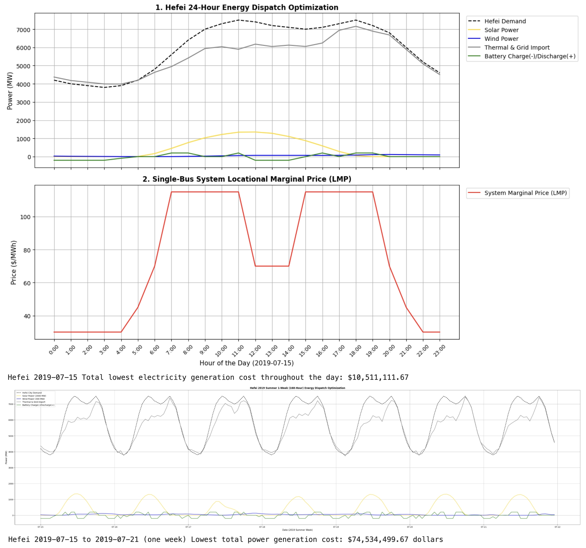
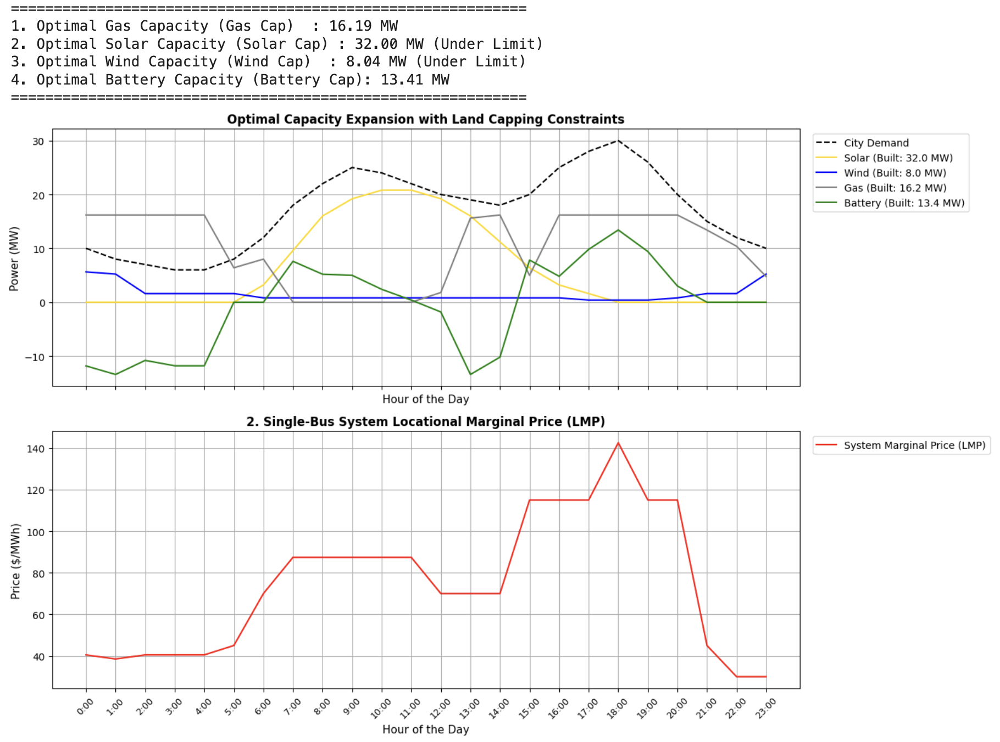
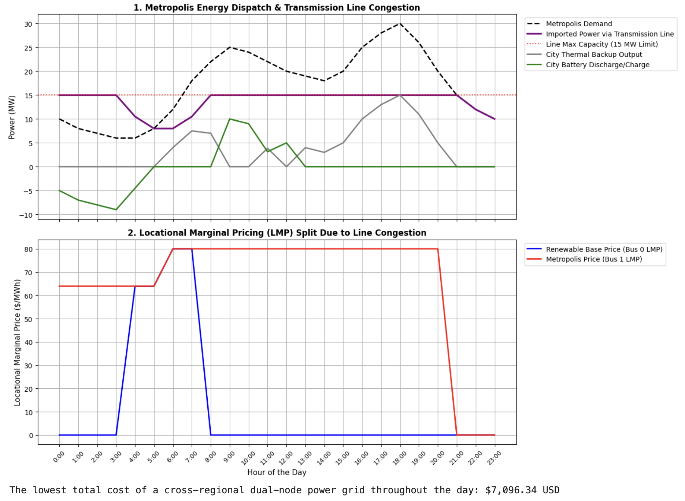
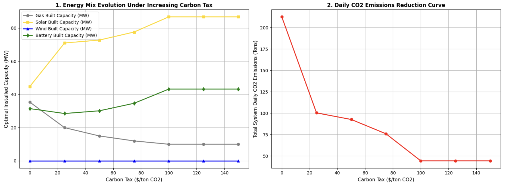

# Microgrid Energy Optimization with PyPSA

This is an independent summer learning project completed after my first year at the University of Illinois Urbana-Champaign.

I used Python, PyPSA, and the HiGHS solver to build a simplified microgrid optimization model. I started with a basic 24-hour single-bus model and then explored four extensions:

1. Hefei solar and wind profiles
2. Generation and battery capacity planning
3. Two-bus transmission congestion
4. Carbon-tax sensitivity

[Open the notebook in Google Colab](https://colab.research.google.com/github/kevdb1/microgrid-energy-optimization/blob/main/Microgrid_Project_26Summer.ipynb)

## Tools

- Python
- PyPSA
- HiGHS
- pandas
- NumPy
- matplotlib
- Google Colab

## Data

The project uses hourly solar and wind profiles for Hefei, China, identified in the source files as Renewables.ninja data.

The timestamps are converted from UTC to China Standard Time (UTC+8).

- [`hf_solar.csv`](hf_solar.csv)
- [`hf_wind.csv`](hf_wind.csv)

## Results

### 1. Hefei Renewable Profiles

I used the Hefei solar and wind profiles in 24-hour and 168-hour dispatch models to study renewable generation, battery operation, grid imports, and hourly electricity prices.

### 2. Capacity Expansion

I allowed the model to select gas, solar, wind, and battery capacities under simplified cost and capacity limits.

The model selected 16.19 MW gas, 32.00 MW solar, 8.04 MW wind, and 13.41 MW battery power.

### 3. Transmission Congestion

I built a two-bus model connected by a 15 MW transmission line. When the line became congested, the two buses had different electricity prices.

### 4. Carbon-Tax Sensitivity

I tested carbon prices from $0 to $150 per metric ton of CO2. Under the model assumptions, higher carbon prices reduced gas capacity and emissions while increasing solar and battery capacity.

## What I Learned

- How to build and solve basic power-system models with PyPSA
- How batteries shift electricity between different hours
- How transmission limits affect electricity prices
- How model assumptions affect capacity and emissions results

## Project Files

- [`Microgrid_Project_26Summer.ipynb`](Microgrid_Project_26Summer.ipynb) - complete Colab notebook
- [`Microgrid_Optimization_Report.pdf`](Microgrid_Optimization_Report.pdf) - English project report
- [`hf_solar.csv`](hf_solar.csv) - solar profile
- [`hf_wind.csv`](hf_wind.csv) - wind profile

## How to Run

1. Open the notebook using the Google Colab link above.
2. Run the installation cell.
3. Upload the two CSV files when prompted.
4. Run the remaining cells in order.

## Note

This is a learning project based on simplified load, cost, and technology assumptions. The results demonstrate the modeling process rather than predict a real power system.

## Author

Yuming (William) Bian  
University of Illinois Urbana-Champaign
